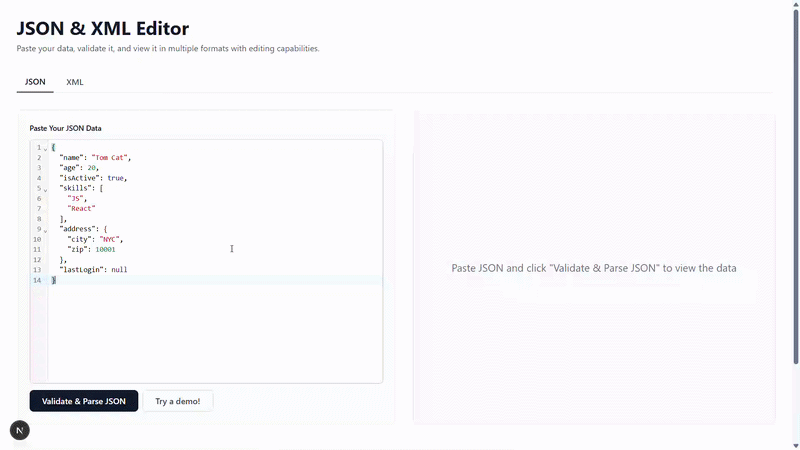

# JSON/XML Editor



## Application Overview

This is a browser-based tool that helps you paste, validate, and explore JSON or XML quickly.
It is designed for day-to-day developer tasks like checking payloads, inspecting nested data, and correcting invalid input without switching between multiple tools.
You can move between visual tree and table views, then edit values in place when you need fast fixes.
The interface stays clean and focused so the workflow feels simple even with large documents.

## Technical Overview

- Built with Next.js and TypeScript.
- Supports parallel JSON and XML flows with mirrored components for input, viewing, and editing.
- Performs real-time validation before rendering structured views.
- Provides tree and table renderers for both data formats.
- Includes in-place editors to update nodes/values directly from the rendered view.
- Uses shared utility validators to keep parsing and validation logic consistent.

## Installation

1. Install Node.js (LTS recommended).
2. Clone this repository.
3. Install dependencies:

```bash
npm install
```

## Usage

1. Start the development server:

```bash
npm run dev
```

2. Open http://localhost:3000.
3. Choose JSON or XML.
4. Paste your data and validate.
5. Explore and edit using tree or table views.

*For more details, check out the [Full Changelog](https://github.com/Deep0902/JSON-Editor/releases)*